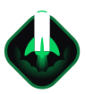

<h1 align="center">NLW Return Impulse</h1>

Trilha Impulse do NLW Return.

  

## Sobre :pencil:

Códigos realizados durante a trilha impulse do evento Next Level Week, realizado pela [Rocketseat](https://www.rocketseat.com.br/).
O projeto é dividido em, _front-end_, _back-end_ e _mobile_. Cada parte está em um diretório separado.

## Tecnologias usadas :rocket:

- [Web 🌐](./web):
  - [React](https://pt-br.reactjs.org/)
  - [Typescript](https://www.typescriptlang.org/)
  - [Tailwindcss](https://tailwindcss.com/)
  - [Phosphor Icons](https://phosphoricons.com/)
- [Server 💻](./server):
  - [Express](https://expressjs.com/pt-br/)
  - [Typescript](https://www.typescriptlang.org/)
  - [Primsa](https://www.prisma.io/)
  - [Jest](https://jestjs.io/pt-BR/)
- [Mobile 📱](./mobile):
  - [React Native](https://reactnative.dev/)
  - [Expo](https://expo.dev/)
  - [Typescript](https://www.typescriptlang.org/)

## Agradecimentos :heart:

- [Rocketseat](https://www.rocketseat.com.br/)
- [Notion](https://efficient-sloth-d85.notion.site/Impulse-58f2daadb8e1433894420cbc57571087)
- [Layout](https://www.figma.com/community/file/1102912516166573468)
